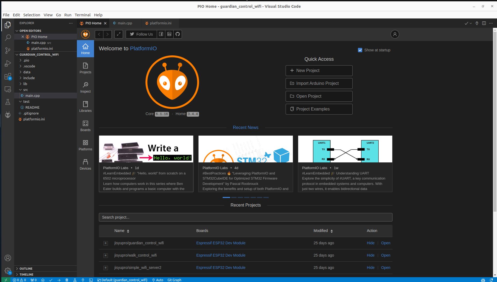
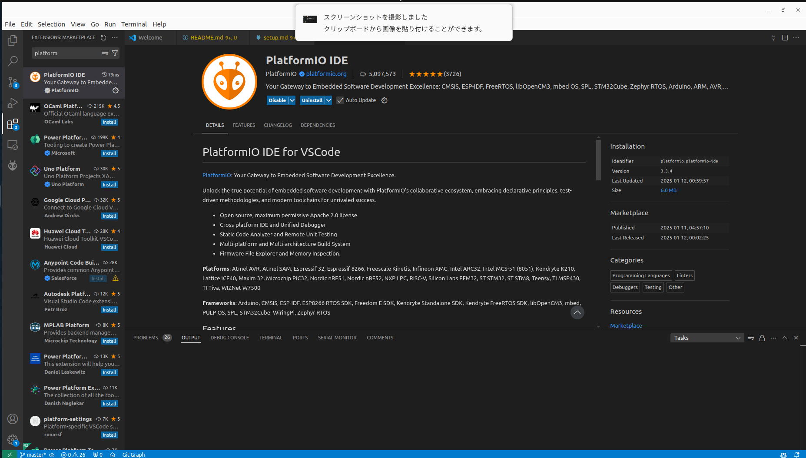

環境構築・動作手順書
==

## PlatformIO IDE


### 環境構築
[参考](https://qiita.com/nextfp/items/f54b216212f08280d4e0)
* VScodeのインストール
* PlatformIO IDE プラグインをインストール



### 使い方
#### projectの作成

#### コンパイル・書き込み

#### ライブラリの追加

#### htmlに書き込む

## krsシリーズをICS変換基板を用いてArduino/ESP32で動かす
* 公式ドキュメントを参照する
  * [準備編](https://kondo-robot.com/faq/ics_board_-tutorial1)
  * [sampleコードでの実践編](https://kondo-robot.com/faq/ics_board_-tutorial2)
* 注意事項
  * ICS変換基板は半田つけが必要
  * サンプルコードはHardSerialのほうで問題ない
  * ライブラリを入れる必要がある→[ICSライブラリ](https://kondo-robot.com/faq/ics-library-a2)
    * クラスなどが定義されている他、sampleコードもその中に入っている
    * Arduino IDEでのライブラリのインストールは Sketch → Include Libraries → Add .ZIP Library ... でダウンロードしたzipファイルを選択 
    * PlatformIOを利用している場合、<code>libs</code>ディレクトリ内などに手動でライブラリを入れる必要がある
  * ボーレートをすべてにおいて統一する必要がある
    * Arduinoでは115200がMaxであるため注意が必要
    * ESP32では1250000で問題なく動作する
    * (私の場合は) (1)srcコード内のボーレート指定 (2)krs自体のボーレート指定 (3)<code>platform.ini</code>内の<code>monitor speed</code>のボーレート指定 の3つの値を揃えないとできなかった
  * krsサーボの設定
    * **WindowsのICSManager**で行うこと(演習でやったubuntu版だとIDの書き換えしかできないかつボーレートが勝手に1250000になるという罠がある)
    * [ics-manager](https://kondo-robot.com/faq/ics35mag)と[usbを認識する用のドライバ](https://kondo-robot.com/faq/ko-driver-2023)を入れる必要がある
      * ダウンロード→解凍したのち、デバイスマネージャーで設定する必要がある(pdfに書いてある)
      * zipファイル内に入っているpdfをよく読む
  * serial0を使用している場合、書き込む際に、RXTXのジャンパピンを抜く必要がある。(していない場合は以下のエラーが出るはず)
```bash
avrdude: stk500_recv(): programmer is not responding 
avrdude: stk500_getsync() attempt 1 of 10: not in sync: resp=0x00
```

